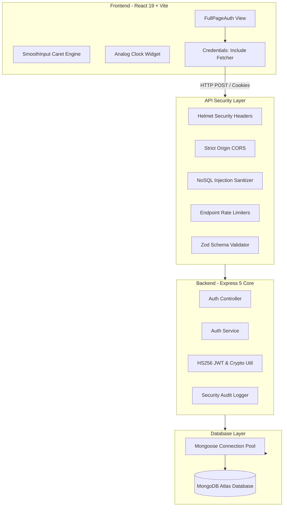

# ADOS — Intelligent Operations & Autonomous Platform

<p align="center">
  
</p>

<p align="center">
  <strong>Enterprise-Grade Full-Stack Authentication & Autonomous Digital Workspace</strong>
</p>

<p align="center">
  
  
  
  
  
  
  
</p>

---

## 📖 Overview

**ADOS** is a high-performance, full-stack enterprise web application delivering intelligent workflow orchestration and secure identity management.

Built with a **Clean Layered Architecture (Controller-Service-Repository)** on the backend and modern **React 19 + Tailwind CSS** on the frontend, ADOS implements defense-in-depth security principles, OWASP compliance, and responsive user experience features including dynamic canvas-driven smooth cursor inputs.

---

## 🚀 Key Features

### 🔐 Enterprise Security & Authentication (Backend)

- **Zero-Trust Token Strategy**: Short-lived JWT Access Tokens (15m) paired with long-lived Refresh Tokens (7d).
- **OWASP Secure Cookies**: Tokens stored in `HttpOnly`, `SameSite=Strict`, `Secure` cookies mitigating XSS and CSRF token theft.
- **Refresh Token Rotation**: Automatic token family rotation with real-time detection of compromised/replayed sessions.
- **Brute-Force & Lockout Protection**: Automatic 30-minute progressive account lockout following 5 consecutive failed attempts.
- **Anti-User Enumeration**: Uniform response envelopes for authentication and password recovery endpoints.
- **Bcrypt Password Hashing**: Adaptive work factor (salt rounds = 12) with schema-level `select: false` prevention.
- **Strict Input Validation (Zod)**: Deep schema validation with `.strict()` enforcement preventing mass assignment.
- **NoSQL Injection Defense**: Recursive in-place sanitization stripping `$` and `.` operators on all incoming requests.
- **Dedicated Rate Limiters**: Calibrated limits for authentication (`15/15m`), password reset (`5/15m`), and refresh (`30/15m`).
- **Security Headers (Helmet)**: Clickjacking defense (`X-Frame-Options: DENY`), strict MIME sniffing guards, and CSP.
- **Sanitized Audit Logging**: Real-time structured security event tracking (`SecurityLogger`) with zero credential leakage.
- **Graceful Shutdown**: Production-ready process signal interception (`SIGTERM`, `SIGINT`, `uncaughtException`).

### 🎨 Modern UI & Interaction (Frontend)

- **Smooth Caret Movement**: Custom input component (`SmoothInput`) utilizing canvas text-measuring and fluid CSS physics transitions (`cubic-bezier(0.16, 1, 0.3, 1)`).
- **Password & Confirm Password**: Client-side regex verification, real-time match indicators, and visibility toggles.
- **Keyboard Navigation**: Fluid `Enter` key auto-progression through inputs to submission.
- **Interactive Analog Clock**: Live SVG minimalist clock widget syncing with real-time system hours, minutes, and seconds.
- **Responsive Workspace**: Split-screen design featuring 3D visuals and responsive full-height card layouts.
- **Micro-Animations**: Framer Motion transitions, spring physics, and animated toast feedback.

---

## 🏛️ System Architecture



---

## 📂 Project Structure

```
ADOS/
├── backend/
│   ├── .env.example                  # Environment configuration template
│   ├── .gitignore                    # Secret & dependency protection
│   ├── package.json                  # Backend dependencies & scripts
│   ├── server.js                     # Bootstrap entrypoint & graceful teardown
│   └── src/
│       ├── app.js                    # Express app configuration & middleware pipeline
│       ├── config/
│       │   ├── env.js                # Fail-fast Zod environment validation
│       │   └── db.js                 # Resilient MongoDB connection pooling
│       ├── constants/
│       │   ├── httpStatus.js         # HTTP status code dictionary
│       │   └── responseMessages.js   # Standardized anti-enumeration messages
│       ├── controllers/
│       │   └── auth.controller.js    # HTTP handlers & cookie management
│       ├── middlewares/
│       │   ├── auth.middleware.js    # JWT bearer & cookie verification + RBAC
│       │   ├── error.middleware.js   # Production error masking & centralized handler
│       │   ├── mongoSanitize.middleware.js # Express 5 in-place operator sanitizer
│       │   ├── notFound.middleware.js # 404 Route catcher
│       │   ├── rateLimiter.middleware.js # Auth, reset, and API rate limiters
│       │   └── validate.middleware.js # Zod schema validation middleware
│       ├── models/
│       │   └── User.model.js         # User schema, bcrypt hooks, lockout methods
│       ├── routes/
│       │   ├── index.js              # Versioned API router (/api/v1) & health probe
│       │   └── auth.routes.js        # Auth endpoint routing & rate limit attachment
│       ├── services/
│       │   └── auth.service.js       # Core business logic & token family rotation
│       └── utils/
│           ├── ApiError.js           # Operational error abstraction
│           ├── ApiResponse.js        # Unified JSON response wrapper
│           ├── asyncHandler.js       # Async route controller wrapper
│           ├── securityLogger.util.js # Sanitized audit logger
│           └── token.util.js         # JWT signing/verification & crypto hashes
│
└── frontend/
    ├── index.html                    # HTML5 entrypoint
    ├── package.json                  # Frontend dependencies & scripts
    ├── vite.config.js                # Vite build configuration
    ├── public/
    │   ├── ados.png                  # ADOS Brand Logo
    │   └── ados2.png                 # ADOS High-Res Visual Asset
    └── src/
        ├── App.jsx                   # Root application component
        ├── index.css                 # Global CSS, Tailwind v4, & smooth caret animations
        ├── main.jsx                  # React DOM root mounting
        ├── assets/
        │   └── ados-character.jpg    # Visual 3D workspace imagery
        └── components/
            ├── ClockWidget.jsx       # Real-time minimalist analog clock
            ├── FullPageAuth.jsx      # Primary split-view authentication page
            └── SmoothInput.jsx       # Canvas-driven smooth gliding input cursor
```

---

## 🛠️ Technology Stack

| Layer                | Technologies                                                                                                 |
| :------------------- | :----------------------------------------------------------------------------------------------------------- |
| **Frontend Core**    | React 19, JavaScript (ESModules), HTML5                                                                      |
| **Styling & Motion** | Tailwind CSS v4, Framer Motion, Lucide Icons                                                                 |
| **Backend Runtime**  | Node.js (v20+ Recommended), Express v5.2                                                                     |
| **Database**         | MongoDB Atlas, Mongoose v9                                                                                   |
| **Security & Auth**  | JSON Web Tokens (`jsonwebtoken`), `bcryptjs`, `helmet`, `cors`, `cookie-parser`, `express-rate-limit`, `zod` |
| **Build & Tooling**  | Vite v8, npm                                                                                                 |

---

## ⚙️ Environment Variables

Create a `.env` file in the `backend/` directory based on [`.env.example`](file:///d:/ADOS/backend/.env.example):

```env
# Server Configuration
PORT=5000
NODE_ENV=development

# Database Configuration
MONGO_URL=mongodb+srv://<username>:<password>@<cluster>.mongodb.net/ados_db?retryWrites=true&w=majority

# CORS Configuration
CORS_ORIGIN=http://localhost:5173

# JWT Security Secrets (Minimum 16 characters)
JWT_ACCESS_SECRET=your_jwt_access_secret_key_here
JWT_ACCESS_EXPIRES_IN=15m
JWT_REFRESH_SECRET=your_jwt_refresh_secret_key_here
JWT_REFRESH_EXPIRES_IN=7d

# Cookie Security Secret (Minimum 16 characters)
COOKIE_SECRET=your_cookie_encryption_secret_here
```

---

## 🚦 Getting Started

### Prerequisites

- **Node.js** (v18.0.0 or higher)
- **npm** (v9.0.0 or higher)
- Active **MongoDB** instance (Local or MongoDB Atlas cluster)

### 1. Clone & Install Dependencies

```bash
# Clone the repository
git clone https://github.com/your-username/ADOS.git
cd ADOS

# Install Backend dependencies
cd backend
npm install

# Install Frontend dependencies
cd ../frontend
npm install
```

### 2. Run the Development Servers

#### Terminal 1 — Backend API

```bash
cd backend
npm run dev
```

> The API server will start on `http://localhost:5000` and automatically establish a pooled connection to MongoDB.

#### Terminal 2 — Frontend Client

```bash
cd frontend
npm run dev
```

> The Vite client will launch on `http://localhost:5173`.

---

## 📡 API Reference (`/api/v1`)

### Health & Telemetry

| Method | Endpoint  | Access | Description                                        |
| :----- | :-------- | :----- | :------------------------------------------------- |
| `GET`  | `/health` | Public | System status, database health, memory, and uptime |

### Authentication (`/auth`)

| Method | Endpoint                 | Access    | Rate Limit   | Description                                     |
| :----- | :----------------------- | :-------- | :----------- | :---------------------------------------------- |
| `POST` | `/auth/register`         | Public    | 15 req / 15m | Register new account & dispatch verification    |
| `POST` | `/auth/login`            | Public    | 15 req / 15m | Authenticate user, set secure cookies & JWTs    |
| `POST` | `/auth/verify-email`     | Public    | 15 req / 15m | Verify account via single-use cryptographic token |
| `GET`  | `/auth/verify-email`     | Public    | 15 req / 15m | Verify account via direct email link click      |
| `POST` | `/auth/resend-verification`| Public  | 3 req / 15m  | Rate-limited resend of verification email       |
| `POST` | `/auth/refresh`          | Public    | 30 req / 15m | Rotate access & refresh tokens                  |
| `POST` | `/auth/forgot-password`  | Public    | 5 req / 15m  | Request single-use password recovery link       |
| `POST` | `/auth/reset-password`   | Public    | 5 req / 15m  | Reset password using valid cryptographic token  |
| `POST` | `/auth/logout`           | Protected | —            | Clear cookies & invalidate server refresh token |
| `GET`  | `/auth/me`               | Protected | —            | Retrieve current authenticated user profile     |

---

## 🧪 Testing & Verification

### Running Automated Security Verification

You can test endpoints, brute-force defenses, and validation rules using PowerShell or cURL:

```powershell
# Test System Health
Invoke-RestMethod -Uri "http://localhost:5000/api/v1/health" -Method Get

# Test User Registration
$body = @{
    name = "Alex Morgan"
    email = "alex.morgan@ados.io"
    password = "Password@2026"
    confirmPassword = "Password@2026"
} | ConvertTo-Json

Invoke-RestMethod -Uri "http://localhost:5000/api/v1/auth/register" -Method Post -ContentType "application/json" -Body $body
```

### Building for Production

```bash
# Verify Frontend Production Bundle
cd frontend
npm run build

# Start Backend in Production Mode
cd ../backend
NODE_ENV=production npm start
```

---

## 🛡️ Security Compliance

- **OWASP Top 10 Aligned**: Protected against Broken Access Control, Injection, Cryptographic Failures, and Security Misconfiguration.
- **CORS Restricted**: Credentials allowed exclusively for configured origin (`http://localhost:5173`).
- **No Token Leakage**: Sensitive credentials, reset tokens, and passwords are never logged or exposed in API envelopes.
